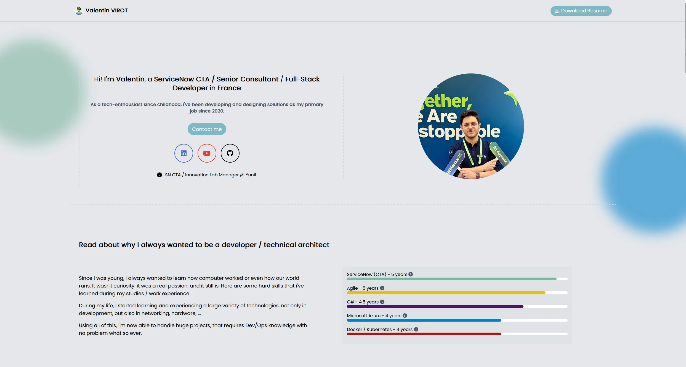
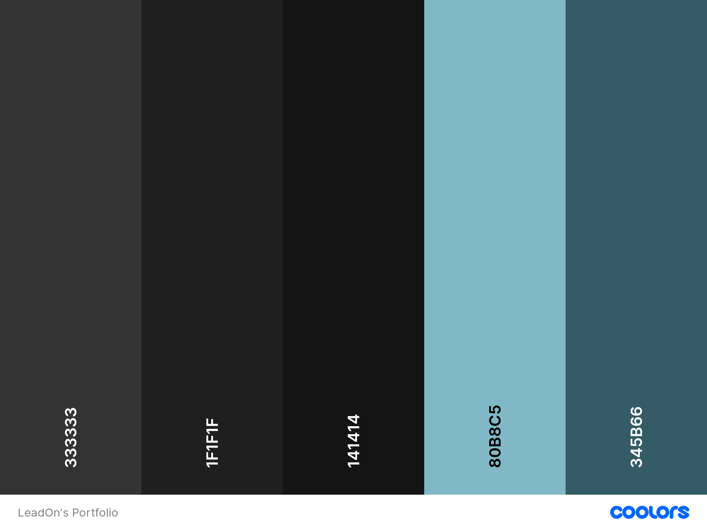

<h1 align="center">LeadOn's Portfolio</h1>

# Description

This project is my own portfolio, done using Angular 17 / Tailwind CSS, and will be running live on [my website](https://www.valentinvirot.fr).
I'm not using every Angular aspects right now. It's really overkill to use it, especially when you check the content of it, but I've choosed to do it that way in order to have a easily maintainable solution in the long term.

Projects are dynamically loaded from GitHub, using GitHub's API.

## How to run it?

Just type `npm ci` to get all dependencies, and then use `ng serve` to run it locally.

## Can I use it for my own website?

If this repo is public, you can clone/fork my project and use it for your own website. Just credit me somewhere in your site / code, as a thanks for my work :)

You can contact me using my [Twitter](https://twitter.com/valentin_vir) account, if you have some question about it. Have fun!

## Color chart

